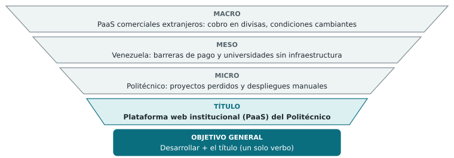
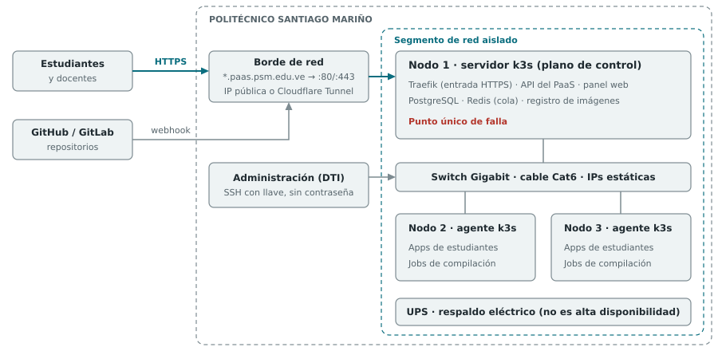
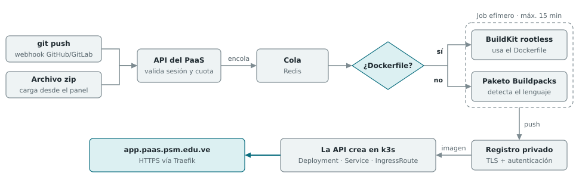
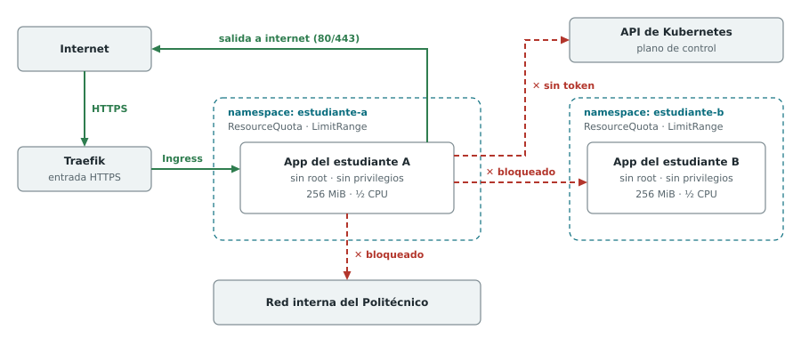
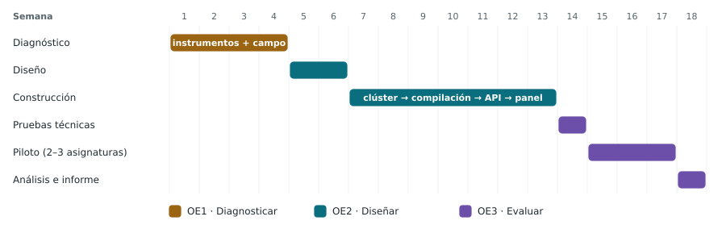

# Diseño y Evaluación de Proyectos — Trabajo de Grado

## Datos generales de la asignatura

- **Profesora:** Carmen Díaz
- **Horarios:** Lunes 9:15 / Jueves 10:00
- **Bibliografía base:** Sapag Chain, Nassir y Reinaldo — *Preparación y Evaluación de Proyectos* (leer Capítulo 1)
- **Manual de referencia:** Manual de elaboración de Trabajos de Grado (Politécnico Santiago Mariño)

## Plan de evaluación

| Unidad | Contenido | Duración | Ponderación |
|---|---|---|---|
| I | Evaluación de Proyectos | 4 semanas | I Corte: 10–20 |
| II | La Investigación y el Marco Teórico | 6 semanas | II Corte: 10–20 |
| III | Las Estrategias metodológicas y su evaluación | 8 semanas | III Corte: 20–20 |

Estrategias metodológicas: conversatorios, trabajos escritos, exposiciones, cuadros comparativos, análisis.

## Conceptos clave vistos (Unidad I)

- **¿Qué es un proyecto?** Elaboración de una metodología, asignación de recursos y delimitación clara, con el fin de solucionar un problema.
- **Título del proyecto:** debe estar directamente ligado al Objetivo General y a la propuesta de investigación.
- **Factibilidad y viabilidad:** el proyecto debe ser factible; la viabilidad radica en generar un beneficio real.
- **Verbos de los objetivos:** entre los verbos que guían la solución del problema destacan **Diagnosticar, Diseñar y Evaluar**.

## Orientaciones del docente (revisión del borrador)

1. **Título sin verbos.** Si un texto lleva verbo, que sea uno solo; en esta primera entrega el título no lleva ninguno. El título nombra la solución (sustantivo + delimitación), no la acción. Así se evitan las objeciones habituales de los profesores de metodología.
2. **Un objetivo general y tres objetivos específicos.** El **objetivo general es el título redactado en infinitivo**: se antepone un único verbo al título y no se le agrega nada más. Cada objetivo específico lleva también un solo verbo.
3. **Del problema al título.** El proyecto da solución a un problema. Al estudiar ese problema en tres niveles, **macro** (contexto global y regional), **meso** (contexto nacional y del sector) y **micro** (la institución o el caso concreto), se llega al **título**, que a su vez resuelve la problemática.

**Secuencia de trabajo:**

1. Problemática
2. Estudio del problema: macro → meso → micro
3. Título (la solución, sin verbos)
4. Objetivo general (el título en infinitivo, un solo verbo)
5. Tres objetivos específicos (Diagnosticar / Diseñar / Evaluar)

---

## Las tres propuestas de proyecto

Se requiere presentar tres candidatos a Proyecto de Grado. Las tres siguen la misma estructura: problema estudiado en los niveles macro, meso y micro, título sin verbos, objetivo general igual al título en infinitivo y tres objetivos específicos de un solo verbo. Además, se mantiene el criterio de Sapag Chain de que todo proyecto debe demostrar factibilidad (técnica) y viabilidad (beneficio real para un tercero).

### 1. Plataforma web institucional de alojamiento y despliegue continuo (PaaS)

> **Título:** *"Plataforma web institucional de alojamiento y despliegue continuo (PaaS) para el Politécnico Santiago Mariño"*

**Problemática:** los estudiantes y docentes del Politécnico Santiago Mariño no cuentan con un espacio institucional para alojar y publicar los proyectos de software que desarrollan en sus asignaturas, y dependen de servicios externos de pago o con planes gratuitos cada vez más limitados.

**Estudio del problema:**

- **Macro:** la enseñanza del desarrollo de software exige publicar aplicaciones en internet, y esa necesidad la cubren sobre todo plataformas comerciales extranjeras (Render, Vercel, Heroku, entre otras). Estos proveedores cobran en divisas, cambian sus condiciones sin aviso (Heroku eliminó su plan gratuito en 2022) y guardan los datos fuera del control de las instituciones educativas.
- **Meso:** en Venezuela se suman barreras propias del país: los pagos internacionales son difíciles, las tarifas en dólares resultan altas para el estudiante y la mayoría de las universidades no tiene infraestructura propia para alojar proyectos estudiantiles. Por eso cada estudiante resuelve el despliegue por su cuenta, con resultados desiguales.
- **Micro:** en el Politécnico Santiago Mariño, los proyectos de distintas materias y niveles de complejidad se alojan en cuentas personales de servicios externos. Esas cuentas vencen y los proyectos se pierden al terminar el período. Los docentes tampoco tienen un punto único para revisar las versiones desplegadas, y cada estudiante pierde horas configurando despliegues manualmente.

**Título → solución:** del estudio anterior surge el título, una plataforma institucional propia que resuelve el alojamiento y el despliegue de los proyectos académicos dentro de la infraestructura del Politécnico.

*Figura 1. Del problema al título. El estudio macro, meso y micro converge en el título, y el título en infinitivo es el objetivo general.*

- **Objetivo general:** Desarrollar una plataforma web institucional de alojamiento y despliegue continuo (PaaS) para el Politécnico Santiago Mariño.
- **Objetivos específicos:**
    1. Diagnosticar las necesidades de alojamiento y despliegue de proyectos académicos de los estudiantes y docentes del Politécnico Santiago Mariño.
    2. Diseñar la arquitectura de la plataforma web de alojamiento y despliegue continuo, con aislamiento por contenedores y límites de recursos.
    3. Evaluar la factibilidad técnica, operativa y económica de la plataforma mediante un piloto con 2–3 asignaturas.
- **Pregunta de investigación:** ¿en qué medida es factible, técnica, operativa y económicamente, una plataforma institucional de alojamiento que permita a estudiantes y docentes del Politécnico Santiago Mariño desplegar sus proyectos académicos sin depender de servicios externos de pago?

#### Enfoque metodológico

- **Modalidad:** proyecto factible, es decir, la propuesta de un modelo operativo viable que resuelve una necesidad concreta de una institución. Se apoya en una investigación de campo (diagnóstico en el Politécnico) y documental (antecedentes y bases teóricas). La modalidad exacta debe confirmarse con el manual de Trabajos de Grado del Politécnico.
- **Fases de la investigación:** cada fase responde a un objetivo específico: **diagnóstico** (OE1), **diseño** (OE2) y **evaluación de factibilidad** (OE3). La construcción del prototipo no es un fin en sí misma; es el medio para evaluar la propuesta con datos reales.
- **Población y muestra:** estudiantes y docentes de las asignaturas de programación y desarrollo de software del Politécnico, más el personal del departamento de tecnología. La muestra es intencional: se escogen las secciones que participarán en el piloto.
- **Instrumentos:**
    - Cuestionario a estudiantes (escala Likert y preguntas cerradas sobre servicios usados, gasto, pérdida de proyectos y tiempo invertido en desplegar).
    - Cuestionario o entrevista a docentes (cómo reciben y revisan los proyectos desplegados).
    - Entrevista semiestructurada al departamento de tecnología (red, IP pública, DNS, energía, espacio físico y políticas de uso).
    - Ficha de observación de la infraestructura disponible.
- **Validez y confiabilidad:** validación de los instrumentos por juicio de tres expertos, prueba previa del cuestionario y cálculo del coeficiente Alfa de Cronbach.
- **Evaluación según Sapag Chain:**
    - **Estudio técnico:** capacidad del clúster, pruebas de carga y de aislamiento.
    - **Estudio económico:** inversión y costos de operación frente al costo evitado de los servicios externos, expresado como relación beneficio-costo.
    - **Estudio organizacional y legal:** quién administra la plataforma, reglamento de uso aceptable y tratamiento de los datos de los usuarios.

#### Arquitectura propuesta (base para el OE2)

Los tres nodos se instalan en las instalaciones del Politécnico (laboratorio o cuarto de servidores), en un segmento de red asignado por el departamento de tecnología.

| Componente | Ubicación | Función |
|---|---|---|
| Nodo 1: servidor k3s | Equipo HP 1 | Plano de control de Kubernetes, Traefik (incluido en k3s en su versión 2 o 3), API del PaaS, PostgreSQL (datos de la plataforma), Redis (cola de tareas) y registro privado de imágenes |
| Nodos 2 y 3: agentes k3s | Equipos HP 2 y 3 | Aplicaciones de los estudiantes y trabajos de compilación |
| Red | Switch Gigabit, cable Cat6 | IPs estáticas en un segmento aislado de la red administrativa; administración por SSH con autenticación por llave (sin contraseña), solo desde equipos autorizados |
| Energía | UPS | Respaldo eléctrico para los tres nodos y el switch. Es respaldo eléctrico, **no alta disponibilidad**: el nodo 1 es un punto único de falla y se documenta como limitación |
| Sistema operativo | Los tres nodos | Ubuntu Server LTS vigente o Debian estable, sin interfaz gráfica |

*Figura 2. Topología física. Los tres nodos están en un segmento aislado de la red del Politécnico. El tráfico HTTPS (en color) entra por el borde de red hasta Traefik en el nodo 1, que lo reparte a las apps de los nodos 2 y 3 a través del switch.*

**Exposición a internet y dominio (`*.paas.psm.edu.ve`)**

- **Vía principal:** el Politécnico provee una IP pública y reenvía los puertos 80 y 443 hacia Traefik. El subdominio `paas.psm.edu.ve` se delega a un proveedor de DNS con API (por ejemplo, el plan gratuito de Cloudflare) para que cert-manager emita un **certificado comodín de Let's Encrypt mediante validación por DNS (DNS-01)**, que es la única validación que Let's Encrypt admite para comodines.
- **Contingencia:** si el Politécnico no dispone de IP pública, se usa Cloudflare Tunnel. En ese caso el HTTPS público lo termina Cloudflare y cert-manager no es necesario para los certificados públicos.
- La vía se decide en el diagnóstico, porque depende de la infraestructura del Politécnico y de la autorización de su departamento de tecnología.

**Motor de compilación**

- **Fuentes de código:** repositorio de GitHub o GitLab (un webhook dispara la compilación en cada `push`) o carga de un archivo zip desde el panel.
- **Detección automática:** si el proyecto trae `Dockerfile`, se compila con **BuildKit en modo sin privilegios (rootless)**. Si no lo trae, **Paketo Buildpacks** detecta el lenguaje (`package.json`, `requirements.txt`, `go.mod`, etc.) y genera la imagen sin necesidad de Dockerfile.
- **Ejecución:** cada compilación corre como un *Job* efímero de Kubernetes en los nodos agentes, con límite de tiempo (15 minutos) y de recursos. No se usa Kaniko, porque Google lo archivó en 2025; esto debe verificarse al momento de implementar.
- **Registro de imágenes:** registro privado dentro del clúster, con TLS y autenticación, declarado en `registries.yaml` de k3s.
- **Cola de tareas:** Redis con BullMQ o Celery (según el lenguaje del backend), para que las compilaciones no bloqueen la API.
- **Flujo:** fuente → cola → compilación → registro → manifiestos → despliegue en k3s.

**Orquestación de aplicaciones**

Por cada aplicación, la API genera tres recursos en k3s:

- **Deployment:** contenedor, variables de entorno y límites de recursos (por defecto 256 MiB de RAM y medio núcleo de CPU).
- **Service:** expone el puerto interno del contenedor dentro del clúster.
- **IngressRoute de Traefik:** dirige `app.paas.psm.edu.ve` hacia su Service.

Las variables de entorno se guardan como *Secrets* de Kubernetes, no en texto plano.

*Figura 3. Flujo de despliegue. El código llega por webhook o por zip, la API lo encola y un Job efímero lo compila con BuildKit (si hay Dockerfile) o con Buildpacks (si no lo hay). La imagen pasa al registro privado y la API crea los tres recursos en k3s.*

**Seguridad y aislamiento (núcleo del capítulo de diseño)**

La plataforma ejecuta código de terceros, así que este es el mayor riesgo técnico del proyecto.

- **Un namespace por usuario**, con *ResourceQuota* y *LimitRange* para que nadie consuma más de su cuota.
- **NetworkPolicy que niega todo el tráfico por defecto:** una app no puede comunicarse con las de otros usuarios, ni con la red interna del Politécnico, ni con el plano de control. Solo se permite la salida a internet por los puertos necesarios. k3s trae un controlador de NetworkPolicy integrado.
- **Pod Security Admission en nivel `restricted`:** los contenedores corren sin root, sin modo privilegiado, sin acceso al disco del nodo y sin capacidades extra del kernel.
- **Sin credenciales del clúster dentro de las apps:** `automountServiceAccountToken: false`.
- **Límites de uso:** número máximo de apps y de despliegues por usuario, y límite de peticiones a la API.
- **Escaneo de imágenes con Trivy** (opcional, si el cronograma lo permite).
- **Reglamento de uso aceptable** aprobado por el Politécnico (prohíbe minería de criptomonedas, envío masivo de correo y contenido ilícito) y un mecanismo de suspensión de apps.

*Figura 4. Modelo de aislamiento. En verde, el único tráfico permitido: entrada por Traefik y salida a internet. En rojo, lo que bloquean NetworkPolicy y la ausencia de credenciales: otros estudiantes, la API de Kubernetes y la red interna del Politécnico.*

**Autenticación y roles**

- **Inicio de sesión con la cuenta institucional:** OAuth/OIDC si el Politécnico usa Google Workspace o Microsoft 365; si no, registro con correo institucional verificado.
- **Roles:**
    - **Estudiante:** despliega proyectos dentro de las asignaturas en las que está inscrito.
    - **Docente:** crea su asignatura o sección, aprueba a sus estudiantes y consulta sus despliegues y logs.
    - **Administrador** (departamento de tecnología): cuotas, suspensiones y mantenimiento.
- **Ciclo de vida:** los proyectos quedan ligados al período académico. Al cierre se detienen y se archivan (imagen y metadatos), sin borrarlos. Esto responde directamente al problema de los proyectos perdidos.

**Panel web y monitoreo**

- Crear un proyecto a partir de la URL del repositorio o de un zip, y gestionar sus variables de entorno.
- Ver los logs de compilación y de ejecución en tiempo real mediante SSE, conectado a la API de Kubernetes.
- Ver el estado de cada app y gráficas básicas de RAM y CPU obtenidas de metrics-server (incluido en k3s).

**Capacidad del piloto**

La capacidad se calcula en el diagnóstico con las especificaciones reales de los equipos HP:

> Apps simultáneas ≈ (RAM de los nodos agentes − reserva del sistema) ÷ 256 MiB

Por ejemplo, con dos agentes de 16 GB y 2 GB de reserva cada uno: (32 − 4) GB ÷ 0,25 GB ≈ 110 apps. Esta es una cota superior; en la práctica hay que restar la memoria que usan las compilaciones.

#### Cronograma (18 semanas)

| Semanas | Fase | Objetivo | Actividades | Entregable |
|---|---|---|---|---|
| 1–2 | Diagnóstico | OE1 | Revisión documental y antecedentes; diseño de instrumentos y validación por juicio de expertos | Instrumentos validados |
| 3–4 | Diagnóstico | OE1 | Aplicación de cuestionarios y entrevistas; relevamiento de infraestructura del Politécnico (red, IP pública, DNS, energía, equipos); análisis de resultados | Informe de diagnóstico y requisitos |
| 5–6 | Diseño | OE2 | Arquitectura, modelo de seguridad, modelo de datos y roles; estimación preliminar de costos | Documento de diseño |
| 7–8 | Construcción | OE2 | Clúster de 3 nodos operativo; dominio, HTTPS y Traefik respondiendo | Clúster accesible por HTTPS |
| 9–10 | Construcción | OE2 | Motor de compilación (Buildpacks, BuildKit, registro, cola) desde repositorio o zip | Imagen compilada automáticamente |
| 11–12 | Construcción | OE2 | API con manifiestos dinámicos, aislamiento (namespaces, cuotas, NetworkPolicy), autenticación y roles | Despliegue de extremo a extremo |
| 13 | Construcción | OE2 | Panel web, logs en tiempo real y métricas | Plataforma lista para el piloto |
| 14 | Evaluación | OE3 | Pruebas de carga, de aislamiento y de seguridad; correcciones | Informe de pruebas técnicas |
| 15–17 | Evaluación | OE3 | Piloto con 2–3 asignaturas; registro de indicadores; encuesta de satisfacción al cierre | Datos del piloto |
| 18 | Evaluación | OE3 | Análisis de indicadores, estudio económico final y conclusiones | Informe final |

*Figura 5. Cronograma de 18 semanas por objetivo específico. La construcción ocupa 7 semanas; el diagnóstico y la evaluación ocupan 8.*

**Regla de recorte:** la hoja de ruta técnica original asignaba 10 semanas a la construcción; aquí se reduce a 7 para dar espacio al diagnóstico y a la evaluación. Si la construcción se atrasa, se simplifica el panel (se deja solo el estado y los logs). No se recortan el diagnóstico, las pruebas de seguridad ni el piloto, porque son los que sostienen los objetivos 1 y 3.

#### Alcance, indicadores y viabilidad

- **Alcance:**
    - Clúster k3s de 3 nodos en las instalaciones del Politécnico.
    - Despliegue desde un repositorio de GitHub o GitLab (webhook en cada `push`) o desde un zip, con `Dockerfile` o con detección automática por Buildpacks. Node, Python, Go y sitios estáticos tienen soporte oficial; los demás lenguajes de Paketo funcionan sin garantía.
    - Subdominio HTTPS por aplicación, variables de entorno, logs en tiempo real y métricas básicas.
    - Aislamiento, cuotas, autenticación institucional y roles.
    - Piloto de 3 semanas con 2–3 asignaturas.
- **Fuera de alcance:** bases de datos gestionadas; alta disponibilidad del plano de control (hay un solo nodo servidor); facturación; flujos CI/CD complejos (pruebas automáticas, entornos de vista previa); aislamiento reforzado con máquinas virtuales ligeras (gVisor o Kata Containers); escalado automático; dominios personalizados.
- **Indicadores de evaluación:**
    - **Técnicos:** tasa de despliegues exitosos, tiempo promedio de compilación y despliegue frente al proceso manual, disponibilidad durante el piloto (% del tiempo en línea), uso de recursos por aplicación, incidentes de seguridad registrados y resultado de las pruebas de aislamiento.
    - **Operativos:** número de proyectos alojados y de usuarios activos, y satisfacción de estudiantes y docentes (encuesta posterior al piloto).
    - **Económicos:** relación beneficio-costo y % de reducción de costo frente a los servicios externos.
- **Métrica de viabilidad (costo-beneficio):** no se mide en ventas. Se comparan la inversión (equipos, switch, UPS) y los costos de operación en el Politécnico (energía, conectividad, horas de administración) con lo que pagarían estudiantes y docentes por servicios externos, más las horas ahorradas en configurar despliegues manualmente. El resultado se expresa como relación beneficio-costo, siguiendo a Sapag Chain.
- **Base técnica de partida:** ninguna existente. Es desarrollo nuevo, apoyado en la experiencia ya adquirida en despliegue y orquestación de servidores y en una hoja de ruta técnica preliminar, ya revisada y ajustada en este documento.

### 2. Sistema base de gestión administrativa para instituciones educativas

> **Título:** *"Sistema base de gestión administrativa, académica y financiera para instituciones privadas de educación básica y media"*

**Problemática:** las instituciones educativas privadas de pequeña y mediana escala gestionan inscripciones, facturación y nómina con hojas de cálculo o con sistemas genéricos que no se ajustan a su operación. Esto produce errores de imputación y falta de trazabilidad.

**Estudio del problema:**

- **Macro:** la gestión educativa se ha digitalizado, pero las soluciones del mercado están pensadas para instituciones grandes o para otros marcos normativos y resultan costosas o difíciles de adaptar para colegios pequeños.
- **Meso:** en Venezuela, los colegios privados operan con cobros en más de una moneda, obligaciones fiscales de facturación y ajustes frecuentes de mensualidades y nómina. Las herramientas genéricas no contemplan esta realidad.
- **Micro:** en una institución tipo de pequeña o mediana escala, el personal administrativo concilia inscripciones, cobros y pagos a mano. Eso alarga el cierre mensual y deja operaciones críticas sin registro de auditoría.

**Título → solución:** un sistema base, genérico y configurable, que resuelve los procesos administrativos comunes a este tipo de instituciones.

- **Objetivo general:** Desarrollar un sistema base de gestión administrativa, académica y financiera para instituciones privadas de educación básica y media.
- **Objetivos específicos:**
    1. Diagnosticar los procesos administrativos comunes a instituciones educativas privadas de pequeña y mediana escala (inscripciones, facturación y nómina).
    2. Diseñar un modelo de datos y una arquitectura genérica y configurable para varias instituciones.
    3. Evaluar la eficiencia del sistema mediante un caso de estudio simulado o anonimizado.
- **Pregunta de investigación:** ¿es posible diseñar un software base, genérico y configurable, que resuelva los procesos de inscripción, facturación y nómina comunes a instituciones educativas privadas de pequeña y mediana escala con mayor eficiencia que la gestión manual?
- **Alcance:** modelo de datos para varias instituciones; módulos de inscripción, facturación por consumo, nómina y auditoría; validación con un caso de estudio simulado o anonimizado.
- **Fuera de alcance:** integración con sistemas contables externos de terceros, módulos académicos (notas, asistencia) si no existen ya en la base, soporte multiidioma y despliegue como SaaS público para clientes reales.
- **Indicadores de evaluación:** horas-hombre ahorradas, % de reducción de errores de imputación, tiempo de cierre administrativo mensual y cobertura de auditoría (eventos registrados frente al total de eventos críticos).
- **Nota importante de alcance:** este candidato se apoya en la base ya construida y probada en producción (APP-FANA), pero **se presenta ante la universidad como un software base genérico**, sin exponer datos, nombre ni detalles operativos de la institución real que lo usa hoy (es una fuente de ingreso activa, no un proyecto académico). El trabajo de grado documentaría el diseño generalizado del sistema, no el caso de uso específico.
- **Métrica de viabilidad (eficiencia operativa):** horas-hombre ahorradas y reducción de costos por errores contables o de imputación, comparando el proceso manual (o con hojas de cálculo) con el sistema.
- **Base técnica de partida:** la más madura de las tres. Es un sistema en producción con módulos de inscripciones, facturación "por consumo", nómina y auditoría ya resueltos y validados con datos reales. Eso reduce el riesgo técnico casi a cero y permite dedicar el esfuerzo del curso a la parte metodológica y documental (formato del Politécnico Santiago Mariño).

### 3. Sistema de gestión y evaluación financiera de carteras de préstamos y fondos de inversión

> **Título:** *"Sistema de gestión y evaluación de rentabilidad para carteras de préstamos y fondos de inversión de pequeña escala"*

**Problemática:** administrar préstamos y fondos de inversión de pequeña escala exige trazabilidad contable, un cálculo confiable de la rentabilidad y controles de acceso por rol. Las hojas de cálculo y los sistemas genéricos no garantizan esas condiciones con integridad transaccional.

**Estudio del problema:**

- **Macro:** el financiamiento alternativo a la banca tradicional (microcréditos, préstamos entre particulares y fondos pequeños) ha crecido, y buena parte de él se administra con herramientas informales.
- **Meso:** en Venezuela, el acceso al crédito bancario es limitado, lo que impulsa esquemas privados de préstamo e inversión de pequeña escala que operan sin herramientas especializadas.
- **Micro:** quien administra una cartera de este tipo reconstruye a mano saldos, cobros y rendimientos. Así se producen sobreconteos, registros duplicados y proyecciones poco confiables para los inversionistas.

**Título → solución:** un sistema que gestiona la cartera con integridad transaccional y evalúa su rentabilidad.

- **Objetivo general:** Desarrollar un sistema de gestión y evaluación de rentabilidad para carteras de préstamos y fondos de inversión de pequeña escala.
- **Objetivos específicos:**
    1. Diagnosticar los riesgos operativos y contables de la gestión manual de préstamos y fondos de inversión de pequeña escala.
    2. Diseñar un modelo transaccional con control de acceso por rol y bitácora de auditoría para las operaciones críticas.
    3. Evaluar la rentabilidad de la cartera mediante indicadores mensuales y acumulados y un simulador de proyecciones.
- **Pregunta de investigación:** ¿cómo garantizar trazabilidad e integridad en la gestión de carteras de préstamos y fondos de inversión de pequeña escala mediante un sistema transaccional con controles de auditoría, y cuál es su aporte a la rentabilidad y a la reducción del riesgo operativo?
- **Alcance:** modelo transaccional (alta, cobro, avances, amortización y cierre), control de acceso por rol, bitácora de auditoría, indicadores de rentabilidad mensual y acumulada, y simulador de proyecciones.
- **Fuera de alcance:** integración con banca real o pasarelas de pago, cumplimiento regulatorio formal ante entes de supervisión financiera, gestión de varias monedas o de inflación y aplicación móvil completa.
- **Indicadores de evaluación:** % de reducción de errores de reconstrucción histórica, tiempo de cierre mensual, cobertura de auditoría y precisión de las proyecciones del simulador frente a los resultados reales.
- **Ventaja particular:** es el candidato más alineado temáticamente con la bibliografía del curso. Sapag Chain trata directamente la evaluación financiera de proyectos (flujo de caja, rentabilidad, VAN, TIR, factibilidad económica), y el software mismo es una herramienta de evaluación financiera. Por eso la tesis "habla el mismo idioma" que la materia durante todo el semestre y es la más fácil de justificar económicamente.
- **Nota de confidencialidad (igual que el candidato 2):** es un negocio secundario real (gestión de fondos e inversionistas propios), por lo que se presenta ante la universidad de la misma forma: como software base genérico, sin exponer cifras, identidad de fondos ni clientes reales. Los objetivos se enfocan en el diseño del sistema transaccional y la seguridad de la auditoría, no en los datos del negocio que lo respalda.
- **Base técnica de partida:** plataforma en producción (Next.js + Supabase) con módulos de préstamos, fondos, rentabilidad, auditoría e inteligencia de negocio ya en funcionamiento.

---

## Matriz comparativa

| Criterio | 1. PaaS institucional | 2. Gestión administrativa | 3. Financiero (préstamos/fondos) |
|---|---|---|---|
| Originalidad | Alta | Media | Media-alta |
| Riesgo técnico | Alto (aislamiento de código de terceros, clúster de 3 nodos) | Bajo | Bajo-medio |
| Alineación con la materia (Sapag Chain) | Media | Media | Alta |
| Evidencia disponible (base ya construida) | Ninguna: desarrollo nuevo (con hoja de ruta técnica) | Alta (en producción) | Alta (en producción) |
| Ajuste al cronograma (18 semanas del curso) | Exigente: 7 semanas de construcción con alcance ampliado | Cómodo | Cómodo |
| Facilidad de evaluación de resultados | Media (requiere piloto real) | Alta | Alta |
| Dependencia de datos sensibles a anonimizar | Ninguna | Alta | Alta |
| Dependencia de terceros | Alta (departamento de tecnología del Politécnico: espacio, red, IP pública, subdominio) | Baja | Baja |
| Delimitación institucional en el título | Sí (Politécnico Santiago Mariño) | No (institución tipo) | No (caso genérico) |

## Recomendación

Todavía no hay un orden único correcto. La mejor opción depende de si la profesora acepta partir de sistemas ya operativos (candidatos 2 y 3) o exige desarrollo enteramente nuevo, y de qué se quiere priorizar: originalidad técnica o defendibilidad metodológica. Con eso claro:

- **Si buscas la propuesta más defendible, con menor riesgo de ejecución** → **Opción 2**. El riesgo técnico es casi nulo; el trabajo real está en la abstracción del dominio y en la narrativa (debe leerse como diseño y evaluación, no como "mostrar el software que ya hice").
- **Si buscas la propuesta más potente y original, con más margen para lucirte** → **Opción 1**, con el alcance ampliado (clúster de 3 nodos, Buildpacks, repositorio o zip) y alojada en el Politécnico. El cronograma de 18 semanas reserva tiempo para el diagnóstico y la evaluación, y deja solo 7 semanas para construir; si se atrasa, se simplifica el panel, no la investigación. Su riesgo principal ya no es solo técnico: depende de que el departamento de tecnología del Politécnico ceda espacio, red y subdominio. Tras la revisión del docente, es además la única con un contexto micro concreto (el propio Politécnico), lo que facilita el planteamiento del problema.
- **Si buscas la mejor alineación con la teoría del curso** → **Opción 3**. Facilita los estudios de rentabilidad (VAN, TIR, flujo de caja) durante todo el semestre, con el mismo riesgo de narrativa que la opción 2 (cuidar la confidencialidad del negocio real).

**Recomendación concreta:** no dar la opción 1 por favorita de entrada solo por ser la más original. En un jurado universitario suele pesar tanto o más la defendibilidad metodológica y la facilidad de mostrar resultados medibles. Antes de comprometerte, confirma con la profesora si aceptan proyectos basados en sistemas ya operativos; si la respuesta es sí, la opción 2 es objetivamente la de menor riesgo.

## Pendientes

- [ ] Leer Capítulo 1 de Sapag Chain antes de la próxima clase.
- [ ] **Definir con la profesora si se permite basar un proyecto en software ya existente en producción (candidatos 2 y 3), o si se exige desarrollo nuevo.** Esto condiciona directamente cuál de las tres conviene más.
- [ ] Confirmar con el docente el verbo del objetivo general (propuesto: *Desarrollar*; alternativa: *Proponer* si el proyecto se limita a diseño y factibilidad, sin construir la plataforma).
- [ ] Respaldar con fuentes citables los contextos macro, meso y micro de la propuesta elegida (estadísticas, normativas, datos del Politécnico).
- [ ] Decidir el criterio de selección final entre las tres alternativas (usar la matriz comparativa como base).
- [ ] Si se elige el candidato 1:
    - [ ] Solicitar al departamento de tecnología del Politécnico: espacio físico para los 3 equipos, segmento de red, IP pública (o permiso para Cloudflare Tunnel), delegación del subdominio `paas.psm.edu.ve` y proveedor de identidad (Google Workspace, Microsoft 365 o correo institucional).
    - [ ] Confirmar el dominio institucional real (`psm.edu.ve` viene de la hoja de ruta y no está verificado).
    - [ ] Definir si los 3 equipos HP los aporta el autor o el Politécnico (cambia el estudio económico) y relevar sus especificaciones (CPU, RAM, disco) para calcular la capacidad del piloto.
    - [ ] Verificar el estado de las herramientas antes de implementar (Kaniko archivado, versiones de Traefik incluidas en k3s, Paketo, BuildKit rootless).
    - [ ] Redactar el borrador del reglamento de uso aceptable para aprobación del Politécnico.
    - [ ] Iniciar el diagnóstico (encuesta a estudiantes y docentes sobre necesidades de alojamiento).
- [ ] Si se elige el candidato 2 o 3, trabajar la narrativa de generalización y anonimización antes de la exposición.
- [ ] Evaluar si conviene preparar una versión formal del documento para entregar a la profesora (estructura de anteproyecto según el manual del Politécnico Santiago Mariño).
